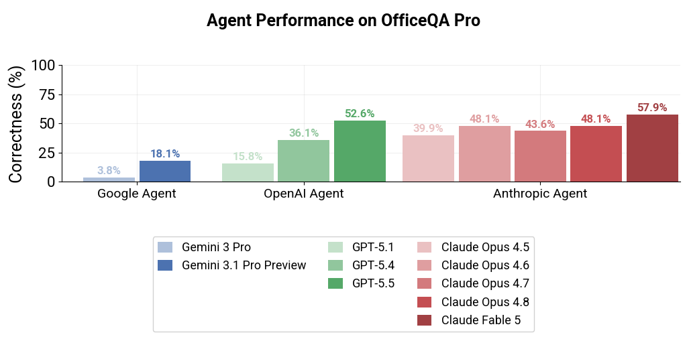
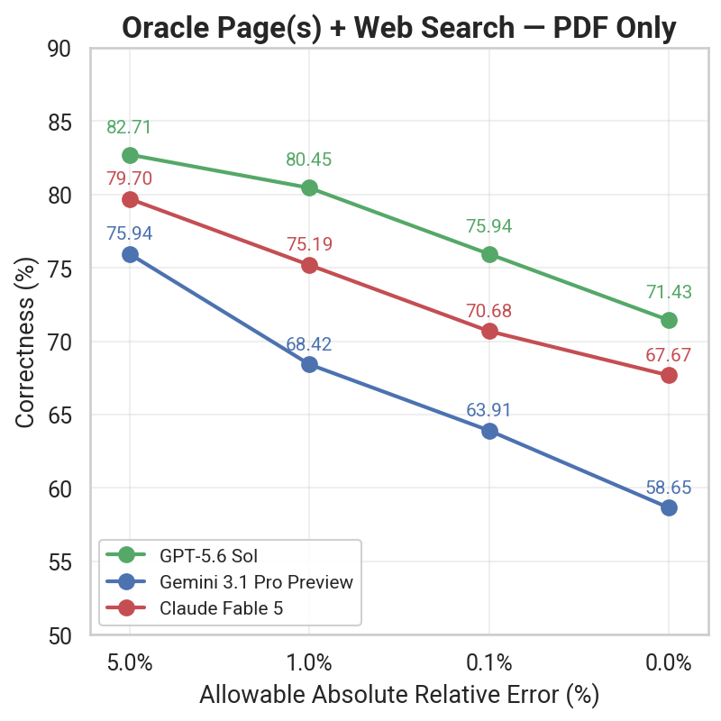
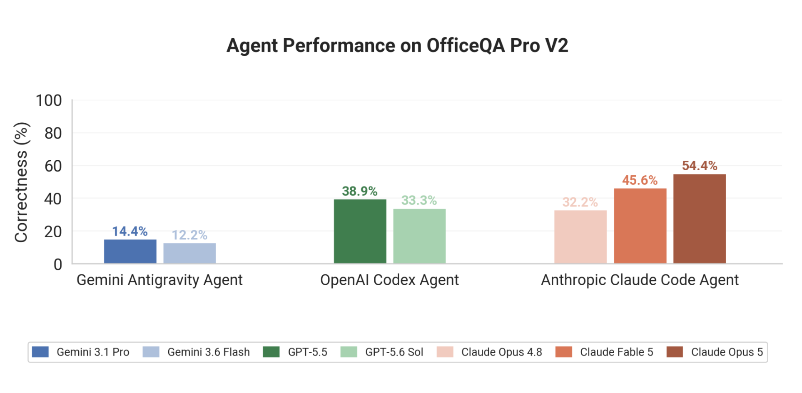

# OfficeQA

A Grounded Reasoning Benchmark Suite by Databricks

<p align="center"></p>

**OfficeQA** is a benchmark suite by Databricks, built for evaluating model / agent performance on end to end **Grounded Reasoning** tasks: answering questions that require finding and combining figures buried in dense, real-world financial documents.

The suite contains three benchmarks, spread across two document corpora:

| Benchmark | Questions | Corpus | Span | Use it for |
|---|---|---|---|---|
| **[OfficeQA Pro](https://huggingface.co/datasets/databricks/officeqa)** | 133 | U.S. Treasury Bulletins | 1939–2025 | The default for evaluating frontier models — the hardest, most discriminative questions |
| **[OfficeQA Full](https://huggingface.co/datasets/databricks/officeqa)** | 246 | U.S. Treasury Bulletins | 1939–2025 | Hillclimbing systems — all of Pro plus 113 easier questions |
| **[OfficeQA Pro V2](https://huggingface.co/datasets/databricks/officeqa-pro-v2)** | 90 | U.S. Federal Accounts of Receipts and Expenditures | 1793–2024 | Testing generalization on a second, harder corpus |

**How they differ:**

1. **OfficeQA Pro** (N=133) is the headline benchmark. Every question is labeled `hard`, and all published results below are measured on it.
2. **OfficeQA Full** (N=246) is a strict superset of Pro: the same 133 `hard` questions plus 113 `easy` ones. The easier items are useful for hillclimbing a system that scores near zero on Pro, and for studying behavior across difficulty levels.
3. **OfficeQA Pro V2** (N=90) is built on an entirely different corpus — Combined Statements of Receipts, Outlays, and Balances of the U.S. Government, plus earlier Congressional serial-set receipts documents. It extends the time span roughly 150 years earlier than the Treasury Bulletins and raises retrieval difficulty substantially: the corpus is larger (1,435 documents vs. 697), the documents are older and harder to parse, and most questions are multi-document (median 5.5 source documents, range 1–24). Because it is a new corpus, it doubles as a generalization test for agents developed against OfficeQA Pro. The best agent harness currently reaches **54.4%** — see [Results](#results).

Additional details:

- Pro and Full questions require the **[U.S Treasury Bulletin](https://fraser.stlouisfed.org/title/treasury-bulletin-407?browse=1930s)** documents to answer; Pro V2 questions require the **U.S. Federal Accounts of Receipts and Expenditures** corpus.
- Datasets released under **CC-BY-SA 4.0** and code and scripts under **Apache 2.0 License**.
- For more information, see the **[OfficeQA Technical Report](https://arxiv.org/abs/2603.08655)**

### Data Access

As of May 2026, all large files (benchmark CSVs, source PDFs, and parsed docs) live on Hugging Face rather than in this GitHub repo. This repo holds the evaluation code and corpus tooling.

Both datasets are **gated**, so that agents browsing the web cannot reach the answer keys. Request access on Hugging Face to get the benchmark questions and answers:

- **Pro and Full** → [`databricks/officeqa`](https://huggingface.co/datasets/databricks/officeqa)
- **Pro V2** → [`databricks/officeqa-pro-v2`](https://huggingface.co/datasets/databricks/officeqa-pro-v2)

Once you've requested and been granted access, you can load any of the three:
```python
from datasets import load_dataset
# Authenticate first: huggingface_hub.login() or set HF_TOKEN env var

pro = load_dataset("databricks/officeqa", data_files="officeqa_pro.csv", split="train")
full = load_dataset("databricks/officeqa", data_files="officeqa_full.csv", split="train")
pro_v2 = load_dataset(
    "databricks/officeqa-pro-v2", data_files="officeqa_pro_v2.csv", split="train"
)
```

## Overview

OfficeQA evaluates how well AI systems can reason over real-world documents to answer complex questions. Both corpora are dense financial PDFs full of wide tables, charts, and narrative text:

| Corpus | Used by | Documents | Span |
|---|---|---|---|
| U.S. Treasury Bulletins | Pro, Full | 697 issues | 1939–2025 |
| U.S. Federal Accounts of Receipts and Expenditures | Pro V2 | 1,435 documents | 1793–2024 |

**Repository Contents:**

| File/Dir | Description |
|---|---|
| `reward.py` | Evaluation script for scoring model outputs — works for all three benchmarks |
| `corpus_scripts/` | Scripts and notebooks for working with the Treasury Bulletin corpus |

**All benchmark data (CSVs, PDFs, parsed docs) is on Hugging Face: [`officeqa`](https://huggingface.co/datasets/databricks/officeqa) (Pro, Full) and [`officeqa-pro-v2`](https://huggingface.co/datasets/databricks/officeqa-pro-v2) (Pro V2).**

**Dataset Schema (**`officeqa_pro.csv` **/** `officeqa_full.csv`**):**


| Column         | Description                                                              |
| -------------- | ------------------------------------------------------------------------ |
| `uid`          | Unique question identifier                                               |
| `question`     | The question to answer                                                   |
| `answer`       | Ground truth answer                                                      |
| `source_docs`  | Original URL(s) from the Federal Reserve Archive                         |
| `source_files` | Corresponding parsed filename(s) (e.g., `treasury_bulletin_1941_01.txt`) |
| `difficulty`   | `easy` or `hard`                                                         |

**Dataset Schema (**`officeqa_pro_v2.csv`**):**

Same first five columns, with no `difficulty` column (all V2 questions are hard) and a richer `source_docs` format:

| Column         | Description                                                                          |
| -------------- | ------------------------------------------------------------------------------------ |
| `uid`          | Unique question identifier (e.g., `qid_7`)                                           |
| `question`     | The question to answer                                                               |
| `answer`       | Ground truth answer                                                                  |
| `source_docs`  | Per-document provenance including the answer's page, `;`-separated (see below)        |
| `source_files` | Corresponding corpus filename(s) (e.g., `combined_statement__historical__cs-1872.txt`) |

Each `source_docs` record takes the form:

```
corpus_file=<name>.txt | pdf_page_number=<n> | year=<yyyy> | month=<name|N/A> | description=<text|N/A>
```

V2 answers come in three shapes — bare numbers (`21.58`), currency (`$7,046,001.98`), and bracketed label/value lists (`[Massachusetts, 0.866]`). `reward.py` handles all three. See the [Pro V2 dataset card](https://huggingface.co/datasets/databricks/officeqa-pro-v2) for the full corpus filename conventions and parsed-JSON element structure.


## Results

Headline results on **OfficeQA Pro** (N=133), followed by **OfficeQA Pro V2** (N=90). See the [OfficeQA Technical Report](https://arxiv.org/abs/2603.08655) for the full evaluation methodology and additional settings.

### OfficeQA Pro — Agent Harness Performance

End-to-end performance of frontier agents operating over the Treasury Bulletin PDF corpus tested in their respective agent harnesses given full capabilities so it can perform file search (read, grep, glob, etc.), web search, programming execution and other tool functionalities. Tests Claude Claude Agent SDK, Codex SDK and Gemini (deprecated)/Antigravity CLI on respective frontier models 


<p align="center">
  
</p>


GPT-5.1 and Opus 4.5 Results included as reference point to results from the [OfficeQA blog](https://www.databricks.com/blog/introducing-officeqa-benchmark-end-to-end-grounded-reasoning) and re-run with latest OfficeQA Pro. Recorded on March 9 2026 [OfficeQA Technical Report](https://arxiv.org/abs/2603.08655).

GPT-5.4 and Opus 4.6 Results recorded on March 9 2026 [OfficeQA Technical Report](https://arxiv.org/abs/2603.08655).
Opus 4.7 Results recorded on April 21 2026.

GPT-5.5, GPT-5.6 Sol, Opus 4.8, and Claude Fable 5 Results updated July 20 2026.

Opus 5 and Antigravity Gemini 3.1 Pro (denoted by *) results updated August 2 2026

### OfficeQA Pro — LLM with Oracle Page(s) + Web Search (PDF Only)

LLM performance when provided the oracle page(s) needed to answer each question along with web search access, evaluated across varying absolute relative error tolerances.

<p align="center">
  
</p>

GPT-5.4 and Opus 4.6 Results recorded on March 9 2026 [OfficeQA Technical Report](https://arxiv.org/abs/2603.08655).
Opus 4.7 Results recorded on April 21 2026.

GPT-5.5, GPT-5.6 Sol, Opus 4.8, and Claude Fable 5 Results updated July 20 2026.

### OfficeQA Pro V2 — Agent Harness Performance

End-to-end performance of frontier agents on **OfficeQA Pro V2** (N=90), operating over the Receipts and Expenditures PDF corpus in their respective agent harnesses with full tool capabilities (file search, web search, code execution). Same evaluation setup as the OfficeQA Pro agent harness results above.

<p align="center">
  
</p>

V2 is substantially harder than OfficeQA Pro: the best agent reaches 54.4%, and the Gemini Antigravity harness lands under 15%.

## Getting Started

### 1. Load the benchmark questions (from Hugging Face)

```python
from datasets import load_dataset
# Authenticate first (both datasets are gated)
# huggingface_hub.login() or set HF_TOKEN env var

# Pro subset — default for evaluating frontier models (N=133)
dataset = load_dataset("databricks/officeqa", data_files="officeqa_pro.csv", split="train")

# Full benchmark — includes easier questions for hillclimbing (N=246)
dataset = load_dataset("databricks/officeqa", data_files="officeqa_full.csv", split="train")

# Pro V2 — new Receipts and Expenditures corpus, generalization test (N=90)
dataset = load_dataset(
    "databricks/officeqa-pro-v2", data_files="officeqa_pro_v2.csv", split="train"
)
```

### 2. Clone the code repository (for reward.py and scripts)

```bash
git clone https://github.com/databricks/officeqa.git
cd officeqa
```

### 3. Download the corpus (from Hugging Face)

Each benchmark has its own corpus, in its own Hugging Face repo. Download the one matching the benchmark you're running.

#### OfficeQA Pro & Full: **Treasury Bulletins**

We recommend the parsed txt files:

```python
from huggingface_hub import snapshot_download

# Download transformed text (recommended for LLM/RAG workflows, ~460MB)
local_dir = snapshot_download(
    repo_id="databricks/officeqa",
    repo_type="dataset",
    allow_patterns="treasury_bulletins_parsed/transformed/*.txt",
)
```

If you'd like to use the raw json parse or original PDFs, you can also download them here:

```python
# Download parsed JSON docs (~730MB, with bounding boxes, tables, metadata)
local_dir = snapshot_download(
    repo_id="databricks/officeqa",
    repo_type="dataset",
    allow_patterns="treasury_bulletins_parsed/jsons/*.json",
)

# Download original PDFs (~4GB)
local_dir = snapshot_download(
    repo_id="databricks/officeqa",
    repo_type="dataset",
    allow_patterns="treasury_bulletin_pdfs/*",
)
```

| Format          | Best for                                                           | Size   |
| --------------- | ------------------------------------------------------------------ | ------ |
| PDFs            | Systems with native PDF support, or you want to parse from scratch | ~4GB   |
| Parsed JSON     | Full structural information, coordinates                           | ~730MB |
| Transformed TXT | LLM/agent consumption, cleaner text                                | ~460MB |

#### OfficeQA Pro V2: **Receipts and Expenditures**

This corpus ships as parsed JSON and PDFs (no pre-transformed txt):

```python
from huggingface_hub import snapshot_download

# Parsed JSONs — recommended starting point (~794MB, 1,435 documents)
local_dir = snapshot_download(
    repo_id="databricks/officeqa-pro-v2",
    repo_type="dataset",
    allow_patterns="parsed_corpus/jsons/*.json",
)

# Original PDFs (~13.3GB)
local_dir = snapshot_download(
    repo_id="databricks/officeqa-pro-v2",
    repo_type="dataset",
    allow_patterns="pdfs/*",
)
```

| Format      | Best for                                          | Size    |
| ----------- | ------------------------------------------------- | ------- |
| PDFs        | Native PDF support, or parsing from scratch       | ~13.3GB |
| Parsed JSON | LLM/agent consumption, structure and coordinates  | ~794MB  |

Only 249 of the 1,435 V2 documents are referenced by the 90 questions. To avoid the full 13.3GB, filter the `source_files` column and pass just those documents to `allow_patterns`. Note that `source_files` entries carry a `.txt` extension, so strip it to get the basename shared by the PDF and JSON representations:

```python
import os

# source_files is ";"-separated, e.g. "combined_statement__historical__cs-1872.txt"
stems = {
    os.path.splitext(name.strip())[0]
    for row in dataset["source_files"]
    for name in row.split(";")
    if name.strip()
}  # -> 249 documents

local_dir = snapshot_download(
    repo_id="databricks/officeqa-pro-v2",
    repo_type="dataset",
    allow_patterns=[f"parsed_corpus/jsons/{stem}.json" for stem in stems],
)
```

See [`corpus_scripts/`](corpus_scripts/) for scripts to create alternative text representations from the parsed JSONs, and to visualize the parsed bounding boxes on top of the PDFs (Treasury Bulletins). The Pro V2 repo ships its own `render_officeqa_json_simple.py` for the same purpose.

### 4. Evaluate your model outputs

The same `reward.py` scores all three benchmarks — it is corpus-agnostic.

```python
from reward import score_answer

# Score a single prediction
score = score_answer(
    ground_truth="123.45",
    predicted="123.45",
    tolerance=0.01  # 1% tolerance for numerical answers
)
print(f"Score: {score}")  # 1.0 for correct, 0.0 for incorrect

# Also handles the currency and bracketed-list answers used in Pro V2
score_answer(ground_truth="$7,046,001.98", predicted="$7,046,001.98", tolerance=0.0)
score_answer(
    ground_truth="[Massachusetts, 0.866]",
    predicted="Massachusetts, with a ratio of 0.866",
    tolerance=0.0,
)
```

The `reward.py` script provides fuzzy matching for numerical answers with configurable tolerance levels:

- `0.0%` - Exact match
- `0.1%` - Within 0.1% relative error
- `1.0%` - Within 1% relative error
- `5.0%` - Within 5% relative error
etc.


## Mapping source URLs to parsed files (Pro / Full)

This section covers the Treasury Bulletin corpus used by Pro and Full. Pro V2 needs no URL mapping: drop the `.txt` extension from a `source_files` entry and you have the basename shared by both representations — `combined_statement__historical__cs-1872.txt` becomes `pdfs/combined_statement__historical__cs-1872.pdf` and `parsed_corpus/jsons/combined_statement__historical__cs-1872.json`. See the [Pro V2 dataset card](https://huggingface.co/datasets/databricks/officeqa-pro-v2) for the filename conventions of each document family.

The `source_files` column in the dataset CSVs provides the direct filenames (e.g., `treasury_bulletin_1941_01.txt`) for easy reference. Here's how the URL-to-filename conversion works:

**URL format:** `https://fraser.stlouisfed.org/title/treasury-bulletin-407/{MONTH}-{YEAR}-{ID}?page={PAGE}`

**Filename format:** `treasury_bulletin_{YEAR}_{MONTH_NUM}.{ext}`

**Month name to number mapping:**

```
january   → 01    july      → 07
february  → 02    august    → 08
march     → 03    september → 09
april     → 04    october   → 10
may       → 05    november  → 11
june      → 06    december  → 12
```

**Example:**

- URL: `https://fraser.stlouisfed.org/title/treasury-bulletin-407/january-1941-6529`
- JSON file: `treasury_bulletins_parsed/jsons/treasury_bulletin_1941_01.json`
- Text file: `treasury_bulletins_parsed/transformed/treasury_bulletin_1941_01.txt`
- PDF file: `treasury_bulletin_pdfs/treasury_bulletin_1941_01.pdf`
